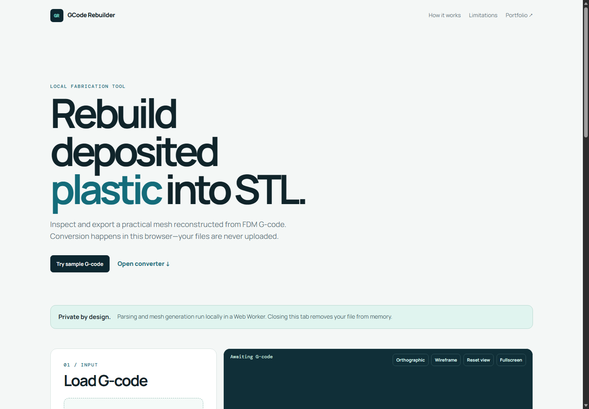

# GCode Rebuilder

GCode Rebuilder is a privacy-first, browser-based utility that reconstructs FDM extrusion paths as a practical STL mesh. It processes files locally—no G-code is uploaded or persisted.



## Features

- Drag-and-drop `.gcode`, `.gco`, and plain-text G-code.
- Client-side parser in a Web Worker with progress reporting.
- G0/G1 movement, G2/G3 I/J arcs, G90/G91 positioning, M82/M83 extrusion modes, G92 resets, retractions, Z layers, and tool changes.
- Common `TYPE:` / `FEATURE:` slicer comment recognition, including options to omit skirts, brim, supports, and infill.
- Closed deposited-bead triangles, real-time Three.js preview, orbit/pan/zoom, wireframe, orthographic view, and layer filtering.
- Binary STL, ASCII STL, and JSON report download.

## Included 3DBenchy sample

`samples/3dbenchy-sample.gcode` is a bundled, pre-sliced reconstruction demo of the official Creative Tools [single-part 3DBenchy](https://github.com/CreativeTools/3DBenchy/tree/master/Single-part). The original model is CC0/public domain as of 2025. The demonstration slice uses a 0.4 mm nozzle, 0.2 mm layers, one material, standard orientation, no supports, and no startup purge, skirt, or brim deposition. It is sourced from a Creality-maintained Benchy slice and sanitized with `scripts/sanitize-benchy-sample.mjs` to retain only reconstruction-relevant commands.

The bundled G-code is for browser testing only. It omits printer startup and shutdown sequences and must not be sent directly to a physical printer.

## Important limitation

This rebuild is based on the instructions and extrusion paths left after slicing. It cannot recover the original, pre-sliced STL exactly, and it does not emulate every printer's material behavior. It is best for inspecting a practical deposited-path representation.

## Privacy

Files are parsed, analyzed, meshed, previewed, and exported entirely in your browser. No file contents are transmitted by this application.

## Local development

This is a dependency-light static web application. Any static server works:

```bash
python -m http.server 4173
```

Then visit `http://localhost:4173`. Run the parser checks with `npm test` and `npm run check` (Node 20+).

## Deployment

GitHub Actions runs the parser tests then deploys the static files to GitHub Pages. In repository Settings → Pages, select **GitHub Actions** as the source.

## License

[MIT](LICENSE). Three.js is loaded from jsDelivr under its MIT license.
